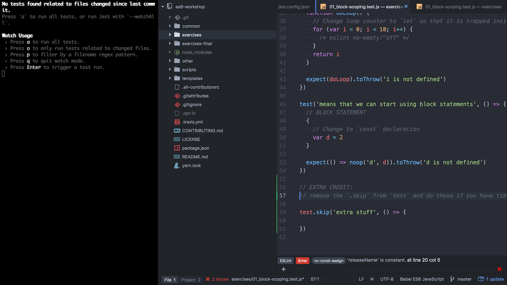

# split-guide

A tool to help generate code for workshop repositories

[![Build Status][build-badge]][build]
[![Dependencies][dependencyci-badge]][dependencyci]
[![version][version-badge]][package]
[![downloads][downloads-badge]][npm-stat]
[![MIT License][license-badge]][LICENSE]

[](#contributors)
[![PRs Welcome][prs-badge]][prs]
[![Donate][donate-badge]][donate]
[![Code of Conduct][coc-badge]][coc]
[![Roadmap][roadmap-badge]][roadmap]
[![Examples][examples-badge]][examples]

[![Watch on GitHub][github-watch-badge]][github-watch]
[![Star on GitHub][github-star-badge]][github-star]
[![Tweet][twitter-badge]][twitter]

## The problem

Managing workshop repositories. A great way to do a workshop repo is to have `exercises` and
`exercises-final` directories. The problem is keeping these two directories in sync.

## This solution

This allows you to create a template for both of these in a `templates` directory. Based on special
text in these files, you can specify what parts of the file you want in `exercises` and
`exercises-final`. This allows you to co-locate what you're going to be showing workshop attendees
and what the final answer should be.

## Installation

This module is distributed via [npm][npm] which is bundled with [node][node] and should
be installed as one of your project's `devDependencies`:

```
npm install --save-dev split-guide
```

## Usage

### Video

I recorded a video to teach people how to use `split-guide` and contribute to one of my workshops:

[](https://youtu.be/CSVOPw_5OT0)

### CLI

This module is a CLI. The best place for it is in your npm scripts
(or [`package-scripts.js`](https://www.npmjs.com/package/p-s)):

```javascript
{
  "scripts": {
    "generate": "split-guide generate"
  }
}
```

This will take all the templates you have in `templates` and create corresponding files in new
`exercises` and `exercises-final` directories.

#### generate

This is currently the only available command. Below is a list of the available options (which are parsed with
the amazing [yargs](https://github.com/yargs/yargs)):

##### `--templates-dir`

Defaults to `./templates`. This is where `split-guide` will look for your template files
Whatever you provide will be be resolved as relative to where you're executing the command (`process.cwd`) (if you're
using npm scripts, that will be where the `package.json` file is located).

`split-guide` will use this to generate a glob that looks like this: `${templatesDir}/**/*`. If you wish to ignore
certain files, you can use the [ignore](#--ignore) option.

##### `--exercises-dir`

Defaults to `./exercises`. This is where `split-guide` will put your exercises files
Whatever you provide will be be resolved as relative to where you're executing the command (`process.cwd`) (if you're
using npm scripts, that will be where the `package.json` file is located).

##### `--exercises-final-dir`

Defaults to `./exercises-final`. This is where `split-guide` will put your exercises-final files
Whatever you provide will be be resolved as relative to where you're executing the command (`process.cwd`) (if you're
using npm scripts, that will be where the `package.json` file is located).

##### `--no-clean`

Defaults to `false`. This will tell `split-guide` to not remove the `exercises` and `exercises-final` directories. This
is useful if you're manually putting files into those directories and don't want to have to do that every time you run
`split-guide`. Normally you probably shouldn't be using this.

##### `--ignore`

Defaults to `undefined`. Can accept multiple values. This will be passed along to `glob` when `split-guide` identifies
the template files. See the [glob](https://github.com/isaacs/node-glob) docs. Note that you may want to pass this
argument in quotes as glob patterns can cause issues in the command line:

```
split-guide generate --ignore "**/*.ignored.js" "**/build/**/*"
```

##### `--silent-success`

By default, `split-guide` will log out how many and which files were saved. Add this to prevent that.

##### `--silent-all`

This will do the same as `--silent-success` but will also silence any errors. It's not recommended to use this option.

### Templates

There are three directives you can use in your files. Each of these is used with a `START` and `END`.

#### Directives

##### COMMENT

Anything in this directive will not appear in the final output of either `exercises` or
`exercises-final`. This is useful to keep notes to yourself about why your template looks a certain
way.

##### WORKSHOP

Anything in this directive will only appear in the `exercises`. This is a good place to add
comments for what the workshoppers should be working on in this part of the code.

##### FINAL

Anything in this directive will only appear in the `exercises-final`. This is a good place to put what the
end result of your workshop should look like.

#### Using directives

Templates can be in any text file format (`.js`, `.md`, `.txt`, etc...). Here's an example of a `.js`
template that uses all of the directives:

**templates/exercise-01/foo.js**

```javascript
// COMMENT_START
// this is the top of the file, and it has comments
// COMMENT_END
module.exports = function sum(a, b) {
  // FINAL_START you can put comments on the same line too
  return a + b
  // FINAL_END
  // WORKSHOP_START
  // return the sum of a and b
  // WORKSHOP_END and on the end line and stuff too
}
```

Given this input, the output would be:

**exercises/exercise-01/foo.js**

```javascript
module.exports = function sum(a, b) {
  // return the sum of a and b
}
```

**exercises-final/exercise-01/foo.js**

```javascript
module.exports = function sum(a, b) {
  return a + b
}
```

## FAQ:

**How do I make it so a file only appears in one of the output directories?**

If the resulting string is empty, then no file will be written. For example, this file would only
appear in exercises-final:

```markdown
// FINAL_START
This will only go into the final directory
// COMMENT_START
this is a comment that wont even appear in the final directory
// COMMENT_END
because the result is an empty string for the exercises directory
// FINAL_END
```

## Inspiration

I've done quite a few workshops that follow similar patterns to this one. I was on an airplane when
I wrote most of this code and I had a blast. So it was inspiring to me :)

## Other Solutions

I am unaware of other solutions. Feel free to submit a PR if you know of similar solutions.

## Related Projects

* [split-guide-atom](https://github.com/janis-kra/split-guide-atom) (Atom plugin): Helps creating workshops by typing the directives for you when you issue the corresponding command

## Contributors

Thanks goes to these people ([emoji key][emojis]):

<!-- ALL-CONTRIBUTORS-LIST:START - Do not remove or modify this section -->
| [<br /><sub>Kent C. Dodds</sub>](https://kentcdodds.com)<br />[💻](https://github.com/kentcdodds/split-guide/commits?author=kentcdodds) [📖](https://github.com/kentcdodds/split-guide/commits?author=kentcdodds) 🚇 [⚠️](https://github.com/kentcdodds/split-guide/commits?author=kentcdodds) 💡 | [<br /><sub>Jack Franklin</sub>](http://www.jackfranklin.co.uk)<br />[📖](https://github.com/kentcdodds/split-guide/commits?author=jackfranklin) | [<br /><sub>Janis Krasemann</sub>](http://www.twitter.com/JanisKra)<br />[📖](https://github.com/kentcdodds/split-guide/commits?author=janis-kra) 🔧 | [<br /><sub>Ray Gesualdo</sub>](https://www.raygesualdo.com)<br />[💻](https://github.com/kentcdodds/split-guide/commits?author=raygesualdo) |
| :---: | :---: | :---: | :---: |
<!-- ALL-CONTRIBUTORS-LIST:END -->

This project follows the [all-contributors][all-contributors] specification. Contributions of any kind welcome!

## LICENSE

MIT

[npm]: https://www.npmjs.com/
[node]: https://nodejs.org
[build-badge]: https://img.shields.io/travis/kentcdodds/split-guide.svg?style=flat-square
[build]: https://travis-ci.org/kentcdodds/split-guide
[dependencyci-badge]: https://dependencyci.com/github/kentcdodds/split-guide/badge?style=flat-square
[dependencyci]: https://dependencyci.com/github/kentcdodds/split-guide
[version-badge]: https://img.shields.io/npm/v/split-guide.svg?style=flat-square
[package]: https://www.npmjs.com/package/split-guide
[downloads-badge]: https://img.shields.io/npm/dm/split-guide.svg?style=flat-square
[npm-stat]: http://npm-stat.com/charts.html?package=split-guide&from=2016-08-01
[license-badge]: https://img.shields.io/npm/l/split-guide.svg?style=flat-square
[license]: https://github.com/kentcdodds/split-guide/blob/master/other/LICENSE
[prs-badge]: https://img.shields.io/badge/PRs-welcome-brightgreen.svg?style=flat-square
[prs]: http://makeapullrequest.com
[donate-badge]: https://img.shields.io/badge/$-support-green.svg?style=flat-square
[donate]: http://kcd.im/donate
[coc-badge]: https://img.shields.io/badge/code%20of-conduct-ff69b4.svg?style=flat-square
[coc]: https://github.com/kentcdodds/split-guide/blob/master/other/CODE_OF_CONDUCT.md
[roadmap-badge]: https://img.shields.io/badge/%F0%9F%93%94-roadmap-CD9523.svg?style=flat-square
[roadmap]: https://github.com/kentcdodds/split-guide/blob/master/other/ROADMAP.md
[examples-badge]: https://img.shields.io/badge/%F0%9F%92%A1-examples-8C8E93.svg?style=flat-square
[examples]: https://github.com/kentcdodds/split-guide/blob/master/other/EXAMPLES.md
[github-watch-badge]: https://img.shields.io/github/watchers/kentcdodds/split-guide.svg?style=social
[github-watch]: https://github.com/kentcdodds/split-guide/watchers
[github-star-badge]: https://img.shields.io/github/stars/kentcdodds/split-guide.svg?style=social
[github-star]: https://github.com/kentcdodds/split-guide/stargazers
[twitter]: https://twitter.com/intent/tweet?text=Check%20out%20split-guide!%20https://github.com/kentcdodds/split-guide%20%F0%9F%91%8D
[twitter-badge]: https://img.shields.io/twitter/url/https/github.com/kentcdodds/split-guide.svg?style=social
[emojis]: https://github.com/kentcdodds/all-contributors#emoji-key
[all-contributors]: https://github.com/kentcdodds/all-contributors
